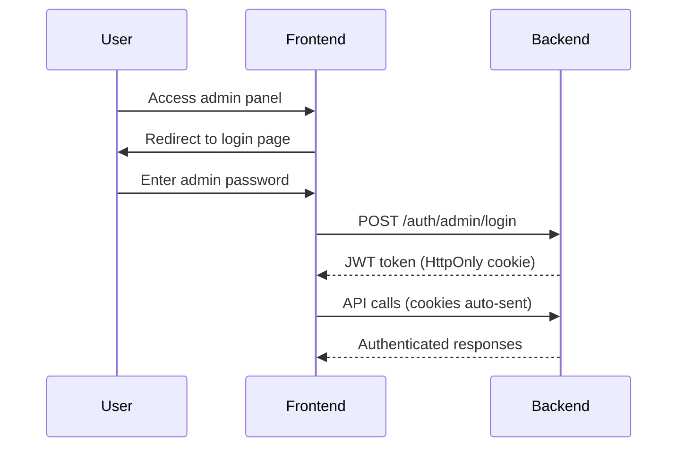

# Admin Dashboard - Comprehensive Documentation

## Table of Contents
1. [Overview](#overview)
2. [Admin Dashboard Structure](#admin-dashboard-structure)
3. [Trading Dashboard Features (Odds Management)](#trading-dashboard-features-odds-management)
4. [Verification & Manual Settlement](#verification--manual-settlement)
5. [User Management Capabilities](#user-management-capabilities)
6. [Bet Management](#bet-management)
7. [Promotional Management Tools](#promotional-management-tools)
8. [Analytics and Reporting](#analytics-and-reporting)
9. [Risk Management Controls](#risk-management-controls)
10. [KYC Verification Tools](#kyc-verification-tools)
11. [Financial/Transaction Management](#financialtransaction-management)
12. [Manual Events Management](#manual-events-management)
13. [Manual Lineup Management](#manual-lineup-management)
14. [Data Scraping Tools](#data-scraping-tools)
15. [Authentication & Security](#authentication--security)

---

## Overview

The admin dashboard is a Next.js application located at `/workspace/extra/programming/Frontend/apps/admin/` that provides comprehensive administrative controls for a sports betting platform with a focus on soccer/football betting analytics.

**Technology Stack:**
- Framework: Next.js 14+ (App Router)
- UI Library: HeroUI (React components)
- Language: TypeScript
- Styling: Tailwind CSS
- Authentication: JWT-based with HttpOnly cookies

**Environment:**
- Development: `http://localhost:3000`
- API Base URL: Configured via `NEXT_PUBLIC_API_URL`
- Authentication: 24-hour JWT tokens

---

## Admin Dashboard Structure

### Navigation Menu
The admin panel features 7 main sections accessible from the navigation bar:

1. **Dashboard** (Home) - Feature overview and quick access
2. **Odds** - Trading dashboard for odds parameter management
3. **Verification** - Manual bet verification with visual tools
4. **Manual Events** - Add match events using 2D pitch visualization
5. **Manual Lineup** - Manage team lineups with player positioning
6. **Scraping** - Manual data scraping tools for games and fixtures
7. **Notifications** - Send push notifications to users

### File Structure
```
/apps/admin/
├── src/
│   ├── app/                      # Next.js pages
│   │   ├── page.tsx             # Dashboard home
│   │   ├── odds/                # Trading dashboard
│   │   ├── verification/        # Bet verification
│   │   ├── manual-events/       # Event management
│   │   ├── manual-lineup/       # Lineup management
│   │   ├── scraping/            # Data scraping
│   │   ├── notification/        # User notifications
│   │   └── login/               # Authentication
│   ├── components/
│   │   ├── features/            # Feature-specific components
│   │   │   ├── odds/           # Trading tools
│   │   │   ├── verification/   # Verification tools
│   │   │   └── notification/   # Notification tools
│   │   └── layout/             # Layout components
│   ├── lib/                     # Utilities
│   │   └── auth.ts             # Authentication helpers
│   └── utils/                   # Helper functions
├── README.md
└── AUTH_README.md
```

---

## Trading Dashboard Features (Odds Management)

The Odds Management page is a sophisticated trading dashboard that allows administrators to configure and adjust betting odds parameters in real-time.

### Location
**Path:** `/odds`
**Component:** `/workspace/extra/programming/Frontend/apps/admin/src/app/odds/page.tsx`

### Core Flow

The trading dashboard follows an intelligent flow that adapts based on analysis type:

```
Season → Import/Export Config → Match → Analysis Type → [Conditional Steps] → Odds → Parameters
```

**Smart Navigation:**
- **Player Odds:** Season → Match → Team → Player → Zones → Odds → Parameters
- **ZAT Odds:** Season → Match → Team → Zones → Odds → Parameters
- **Team Props:** Season → Match → Zones → Odds → Parameters (skips team/player)

### Key Features

#### 1. Season Selection
- **API:** `GET /info/seasons`
- View all available seasons across multiple leagues
- Filter by league (Premier League, La Liga, Bundesliga, Serie A, Ligue 1, etc.)
- Search by season name or year
- Current season highlighting (2024-25)
- Organized display grouped by league

#### 2. Configuration Import/Export
- **Component:** `InitialImportExport`
- **APIs:**
  - `GET /odds/parameters/export/all` - Export all parameters
  - `GET /odds/parameters/export/changed` - Export modified parameters only
  - `POST /odds/parameters/import` - Import parameter configuration
- Download complete parameter sets as JSON
- Import previously exported configurations
- Useful for backup, migration, or season setup

#### 3. Match Selection
- **API:** `GET /info/games/upcoming?season_ids={season_id}&limit=100`
- View upcoming matches filtered by selected season
- Shows match dates, teams, and leagues
- Card-based interface with search capabilities

#### 4. Analysis Type Selection
Three main analysis modes:
- **Player Odds:** Individual player performance in zones
- **ZAT (Zone-Action-Team) Odds:** Team actions in specific zones
- **Team Props:** Game-level betting (moneyline, spread, totals)

#### 5. Team Selection (Conditional)
- **API:** `GET /info/team/{team_id}`
- Select home or away team from the chosen match
- Only required for Player Odds and ZAT analysis
- Skipped for Team Props

#### 6. Player Selection (Player Odds Only)
- **Component:** `PlayerSelector`
- **API:** `GET /info/players/team/{team_id}`
- Filter players by position
- Search by player name
- Position badges for easy identification

#### 7. Zone Analysis & Interactive Pitch
- **Component:** `OddsPitchView` with `SoccerPitch`
- **APIs:**
  - `GET /odds/get_player_odds` (Player analysis)
  - `GET /odds/get_zat_odds` (ZAT analysis)
  - `GET /odds/get_team_prop_odds` (Team Props)

**Features:**
- SVG-based interactive soccer pitch
- 16 zones matching backend `zone_utils.py` coordinates
- Click-to-select zone interaction
- Action selector (goals, assists, shots, passes, tackles, etc.)
- Real-time odds visualization with zone opacity based on probability
- Hover effects with zone information
- Multiple action types supported

**Zone Layout:**
```
P1  P2  P3  P4  (Penalty box zones)
M1  M2  M3  M4  (Midfield zones)
D1  D2  D3  D4  (Defensive zones)
G1  G2  G3  G4  (Goal area zones)
```

#### 8. Parameter Management (Player Odds)
- **Component:** `ParameterManagement`
- **API:** `GET /odds/parameters/controllable`
- Hierarchical parameter view:
  - **Global:** Model-wide parameters
  - **Player Specific:** Individual player parameters
  - **Team Specific:** Team-based parameters
  - **Zonal Specific:** Zone-specific parameters

**Parameter Card Features:**
- **Component:** `ParameterCard`
- **API:** `PUT /odds/parameters/adjust`
- Interactive bounds adjustment with sliders
- Preset suggestions (Conservative, Moderate, Aggressive)
- Real-time value and bounds editing
- Enable/disable parameter toggle
- Visual feedback for modified parameters
- Parameter information tooltips

#### 9. Team Parameter Management (ZAT & Team Props)
- **Component:** `TeamParameterManagement`
- **API:** `GET /odds/parameters/team?team_id={team_id}`
- Manage team abilities and counter-abilities
- Tabbed interface for different parameter types
- Real-time parameter updates with bounds adjustment
- Context-aware for both home and away teams

#### 10. Zonal Parameter Management
- **Component:** `ZonalParameterManagement`
- Adjust zone-specific team parameters
- Fine-tune zonal offensive/defensive abilities
- Visual zone reference for parameter context

#### 11. Change Management
- **Component:** `ParameterChangesPanel`
- **APIs:**
  - `GET /odds/parameters/changes/log` - View change history
  - `GET /odds/parameters/export/changed` - Export modified parameters
  - `DELETE /odds/parameters/changes/log` - Clear change history
- Track all parameter modifications
- Export changes to JSON file
- View modification timestamps
- Clear change history

#### 12. Combined View
- Side-by-side odds display with parameter adjustment
- Real-time parameter updates
- Synchronized odds recalculation
- Context-aware based on analysis type

### Technical Implementation

**State Management:**
- React hooks for local state
- Centralized flow state with breadcrumb navigation
- Automatic API calls on state changes

**API Integration:**
- Base URL: Configured via `NEXT_PUBLIC_API_URL`
- Centralized `apiRequest()` utility with error handling
- Download utilities for parameter exports
- Proper endpoints using `/admin/*` and `/info/*` paths

**UI/UX Features:**
- Progressive flow with step-by-step guidance
- Breadcrumb navigation showing current position
- Visual feedback: loading spinners, hover states, selection highlights
- Responsive design for desktop and tablet
- Real-time parameter updates reflected immediately

### Advanced Odds Analysis

#### ZAT (Zone-Action-Team) Odds
- **Component:** `ZATOddsDisplay`
- Team performance analysis in specific zones
- Action-based filtering (goals, assists, shots, etc.)
- Over/under odds with probability calculations
- Interactive zone selection

#### Team Proposition Odds
- **Component:** `TeamPropOddsDisplay`
- Game-level betting odds (moneyline, spread, over/under)
- Bet type filtering and organization
- Expected value calculations
- Comprehensive team betting analytics

### Parameter Import/Export System
- **Component:** `ParameterImportExport`
- Export/import parameters in JSON format
- Context-aware (player/team/zonal)
- Backup and restore functionality
- Cross-season parameter migration

---

## Verification & Manual Settlement

The Verification page provides visual bet verification tools with real-time soccer pitch visualizations.

### Location
**Path:** `/verification`
**Component:** `/workspace/extra/programming/Frontend/apps/admin/src/app/verification/page.tsx`

### Overview
Enhanced verification system with real-time soccer pitch visualizations for manual bet verification and administrative operations.

### Key Features

#### 1. Bet Verification System
- **API:** `GET /admin/verification/get_legs_to_verify`
- View all unverified bet legs organized by game
- Three bet types supported:
  - **PlayerPropLeg:** Player actions (shots, goals, etc.) in zones
  - **ZATLeg:** Team actions in specific zones/times
  - **TeamPropLeg:** Game-level bets (moneyline, totals)

#### 2. Visual Verification Interface
- **Component:** `EnhancedLegVisualization`
- **API:** `GET /bets/get_related_events_for_leg/{leg_id}`
- Interactive soccer pitch visualization per bet
- Event plotting with real x,y coordinates:
  - 🟠 **Related events:** All events of action type related to the bet
  - 🟢 **Valid events:** Events that count for the bet
  - 🔵 **Zones:** Active betting areas
- Real field positions (no random dots)
- Away team coordinate transformation for TeamPropLeg

#### 3. Manual Verification
- **API:** `POST /admin/verification/verify_leg`
- HIT/MISS buttons for each leg
- Visual feedback with color-coded states:
  - Green: Verified as HIT
  - Red: Verified as MISS
  - Gray: Pending verification
- Batch verification support
- Pending verification queue

#### 4. Batch Operations
- **API:** `POST /admin/verification/verify_all_legs_for_game`
- Verify all legs for a game at once
- "Commit All" button per game
- Automatic data refresh after verification

#### 5. Update Valid Bets
- **API:** `POST /admin/verification/update_valid_bets`
- Recalculate bet outcomes based on verified legs
- Update user balances
- Processing summary with counts:
  - Total entries processed
  - Hit/Miss/Voided counts
  - Entry IDs by status

### Admin Operations (Dangerous Zone)

Password-protected administrative operations with configurable time windows.

#### 1. Revert Bets
- **API:** `POST /admin/revert_bets`
- Reverts entries whose hit status was updated within time window
- Restores user balances
- Resets entry/leg statuses
- Requires admin password

#### 2. Revert Leg Hit Status
- **API:** `POST /admin/revert_leg_hit_status`
- Resets hit status (man_hit, auto_hit) for legs
- Updated within specified time window
- Keeps bets intact (status-only operation)
- Requires admin password

#### 3. Update All Legs Hit Status
- **API:** `POST /admin/update_all_legs_hit_status`
- Recalculates and updates hit status for all legs
- Safe operation for fixing calculation issues
- System-wide operation
- No password required (read-only recalculation)

#### Configuration
- Time offset: 1-1440 minutes (24 hours max)
- Password authentication required for destructive operations
- Warning notices for irreversible operations
- Detailed operation logging and feedback

### Data Flow
```
1. Load games with unverified legs
2. Click leg → Fetch related events
3. Plot events on pitch with real coordinates
4. Review visualization
5. Manual verify: HIT/MISS
6. Commit verifications
7. Update valid bets
```

### Security Features
- Admin operations require password authentication
- Time-bounded operations to prevent accidental mass changes
- Irreversible operation warnings
- Detailed operation logging and feedback
- Input validation and error handling

---

## User Management Capabilities

### Location
**Path:** `/notification` (user filtering capabilities)
**Component:** `/workspace/extra/programming/Frontend/apps/admin/src/app/notification/page.tsx`

### User Query & Filtering

#### 1. User Configuration
- **API:** `GET /admin/notifications/user-configs`
- Get available user account types
- Get user preference flags
- Populate filtering options

#### 2. User Search & Filtering
- **API:** `POST /admin/notifications/user-ids`
- **Filter by account types:**
  - TBG (main platform)
  - AB (alternate brand)
  - SLOUGH_TOWN (partner)
  - Multi-select OR logic within account types

- **Filter by preference flags:**
  - `bet_verified_flag`: Users wanting bet notifications
  - `game_upcoming_flag`: Users following teams/leagues
  - `daily_bonus_flag`: Users wanting daily bonus notifications
  - `weekly_bonus_flag`: Users wanting weekly bonus notifications
  - All flags use AND logic (more restrictive)

- **Active status filtering:**
  - Default: Only active users
  - Optional: Include inactive users
  - Can force send to inactive users

#### 3. User Query Results
- Display total count of matching users
- Return list of user UUIDs
- Preview before sending notifications

### Filter Logic
- **AND logic:** More filters = fewer results
- **Account types:** OR within the list (TBG OR AB)
- **Preference flags:** ALL must be true (AND logic)
- **Active status:** Default excludes inactive users
- **Empty filters:** Returns all active users

### User Insights
While not a dedicated user management page, the notification system provides:
- User segmentation by account type
- User preference analysis
- Active vs inactive user counts
- User targeting capabilities

---

## Bet Management

### Bet Verification (Covered in Section 4)
The primary bet management interface is the Verification page, which handles:
- Viewing unverified bets
- Manual verification of bet outcomes
- Batch bet verification
- Bet status updates

### Bet Settlement Features

#### 1. Manual Verification
- Review each bet leg individually
- Visual confirmation with pitch coordinates
- HIT/MISS manual override
- Support for voided bets

#### 2. Automatic Settlement Updates
- **API:** `POST /admin/verification/update_valid_bets`
- Recalculates all bet outcomes
- Updates user balances automatically
- Processes multiple bet types:
  - PlayerPropLeg
  - ZATLeg
  - TeamPropLeg

#### 3. Settlement Reversion
- **API:** `POST /admin/revert_bets`
- Undo bet settlements within time window
- Restore user balances
- Reset bet statuses
- Password-protected operation

### Bet Types Supported
1. **Player Prop Bets:** Individual player performance
2. **Zone-Action-Team (ZAT) Bets:** Team actions in zones
3. **Team Proposition Bets:** Game-level outcomes

---

## Promotional Management Tools

Based on the current codebase analysis, promotional management is handled through the notification system.

### Location
**Path:** `/notification`
**Component:** `/workspace/extra/programming/Frontend/apps/admin/src/app/notification/page.tsx`

### Promotional Capabilities

#### 1. Bonus Notification Management
- **Daily Bonus Flag:** Target users who want daily bonus notifications
- **Weekly Bonus Flag:** Target users who want weekly bonus notifications
- Send custom promotional notifications
- User segmentation by preference

#### 2. Push Notification System
- **API:** `POST /admin/notifications/send`
- Send custom promotional messages
- Title: 1-100 characters
- Body: 1-200 characters
- Target specific user segments

#### 3. User Targeting
- Filter by account type for brand-specific promotions
- Filter by user preferences
- Include/exclude inactive users
- Batch notification sending

### Notification Workflow
```
1. Select user filters (account type, preferences)
2. Query matching users
3. Preview user count
4. Compose notification (title + body)
5. Send to all matching users
6. View delivery results
```

### Notification Features
- Character counters for title/body
- Force send option for critical notifications
- Delivery tracking with success/failure reasons
- Bulk notification support

**Note:** Dedicated promotional code management, reward systems, and bonus configuration may be available through backend APIs but are not exposed in the current admin frontend.

---

## Analytics and Reporting

The admin dashboard includes several analytics features distributed across different sections.

### 1. Odds Analytics

#### Parameter Change Tracking
- **API:** `GET /odds/parameters/changes/log`
- View all parameter modifications over time
- Track which parameters were changed
- Monitor adjustment patterns
- Export change history

#### Odds Visualization
- Zone-based probability heatmaps
- Expected value calculations for Team Props
- Over/under probability displays
- Action-specific odds analysis

### 2. Bet Verification Reports
- **API:** `POST /admin/verification/update_valid_bets`
- Summary statistics after bet updates:
  - Total entries processed
  - Hit count (winning bets)
  - Missed count (losing bets)
  - Voided count (cancelled bets)
  - Entry IDs by status

### 3. Notification Analytics
- **API:** `POST /admin/notifications/send`
- Notification delivery results:
  - Total users targeted
  - Successful deliveries
  - Failed deliveries
  - Failure reasons (no token, inactive, etc.)
  - Per-user delivery status

### 4. User Segmentation Analytics
- **API:** `POST /admin/notifications/user-ids`
- User counts by filter criteria
- Account type distribution
- User preference statistics
- Active vs inactive user ratios

### Reporting Features
- JSON export for parameter changes
- Detailed operation results
- Real-time success/failure feedback
- Timestamp tracking for all operations

**Note:** Dedicated financial reporting, revenue analytics, and comprehensive dashboards may be available through backend APIs but are not currently exposed in the frontend.

---

## Risk Management Controls

The admin dashboard provides several risk management tools:

### 1. Parameter Bounds Management

#### Conservative Mode
- Tight parameter bounds
- Lower adjustment ranges
- Risk-averse odds
- Preset: Conservative bounds adjustment

#### Moderate Mode
- Balanced parameter bounds
- Standard adjustment ranges
- Normal odds ranges
- Preset: Moderate bounds adjustment

#### Aggressive Mode
- Wide parameter bounds
- Higher adjustment ranges
- Risk-tolerant odds
- Preset: Aggressive bounds adjustment

### 2. Odds Parameter Controls

#### Value Constraints
- Minimum/maximum value bounds
- Constrained value calculations
- Effective value tracking
- Bounds adjustment with visual feedback

#### Adjustment Tracking
- Auto adjustments logged
- Manual adjustments tracked
- Cumulative adjustment view
- Export adjustment history

### 3. Real-time Monitoring

#### Parameter Changes Panel
- **Component:** `ParameterChangesPanel`
- Live view of parameter modifications
- Clear change history capability
- Export changes for audit

#### Odds Recalculation
- Immediate odds updates after parameter changes
- Real-time probability calculations
- Expected value recalculation

### 4. Bet Settlement Safeguards

#### Time-bounded Operations
- 1-1440 minute time windows for revert operations
- Prevents accidental mass reversions
- Configurable safety windows

#### Password Protection
- Admin password required for destructive operations
- Revert bets protection
- Leg status revert protection

#### Warning Systems
- Clear warnings for irreversible operations
- Confirmation dialogs
- Detailed operation descriptions

### 5. Verification Controls

#### Manual Override
- Admin review before auto-settlement
- Visual verification tools
- Batch verification safeguards
- Clear HIT/MISS indicators

### Risk Management Strategy
The system follows a **multi-layer approach**:
1. **Preventive:** Parameter bounds and constraints
2. **Monitoring:** Real-time change tracking and logs
3. **Corrective:** Revert operations with safety mechanisms
4. **Verification:** Manual review before final settlement

---

## KYC Verification Tools

**Current Status:** Based on the codebase analysis, dedicated KYC (Know Your Customer) verification tools are not implemented in the current admin frontend.

### Available User Verification Features

#### 1. User Identification
- User UUID tracking in bets
- User account type identification (TBG, AB, SLOUGH_TOWN)
- User preference flags

#### 2. Account Status Management
- Active vs inactive user filtering
- User notification preferences
- Account type segmentation

### Potential Backend Integration
The verification page's user query system (`/admin/notifications/user-ids`) provides infrastructure that could support KYC features:
- User identification
- Account status tracking
- User preference management

**Note:** Dedicated KYC document upload, identity verification, address verification, and compliance tools would need to be implemented if required.

---

## Financial/Transaction Management

**Current Status:** Based on the codebase analysis, dedicated financial/transaction management interfaces are not fully implemented in the current admin frontend.

### Available Financial Operations

#### 1. Bet Settlement & Balance Updates
- **API:** `POST /admin/verification/update_valid_bets`
- Automatic user balance updates after bet settlement
- Credit winning bets to user accounts
- Debit losing bets from user accounts

#### 2. Bet Reversion & Refunds
- **API:** `POST /admin/revert_bets`
- Restore user balances when reverting bets
- Undo bet settlements within time window
- Balance reconciliation after reversion

### Financial Data Tracked
- User balances (implicit through bet settlement)
- Bet amounts (in leg verification)
- Payout calculations (bet odds × stake)
- Entry amounts for multi-leg parlays

### Potential Backend Integration
The infrastructure exists for:
- Balance modifications through bet operations
- Transaction history through bet logs
- User account management through notification system

**Note:** Dedicated features for deposits, withdrawals, payment methods, transaction history, and financial reporting would need dedicated implementation if required.

---

## Manual Events Management

The Manual Events page allows administrators to add soccer match events manually using a 2D pitch visualization.

### Location
**Path:** `/manual-events`
**Component:** `/workspace/extra/programming/Frontend/apps/admin/src/app/manual-events/page.tsx`

### Overview
Add match events manually when automated event data is unavailable or needs correction. Uses an interactive 2D soccer pitch for precise event placement.

### Key Features

#### 1. Match Selection
- **Component:** `MatchSelector`
- **API:** `GET /info/get_league_games`
- Select by league (EPL, MLS, LaLiga, UCL, BRA)
- Pick date using calendar
- Choose specific match
- Automatic loading of existing events

#### 2. Interactive 2D Pitch
- **Component:** `EventPitch`
- Click-based event placement
- Two modes:
  - **Single-click:** Events with only start coordinates (foul, tackle, card)
  - **Dual-click:** Events with start and end coordinates (shot, pass, clearance)
- Visual feedback:
  - **Gray markers:** Existing events
  - **Blue markers:** Queued events (not yet submitted)
  - **Green marker:** Current click position
- Field rotation toggle for away team perspective

#### 3. Event Form
- **Component:** `EventForm`
- **API:** `GET /info/get_players_for_team`
- Dynamic form adapting to event type:
  - Event type selector (30+ event types)
  - Team selection (home/away)
  - Player selection
  - Time input (minute and second)
  - Period selection (1st half, 2nd half, extra time, penalties)
  - Outcome toggle (success/failure for passes and shots)
  - Auto-filled coordinates from pitch clicks

#### 4. Event Types Supported

**Shot Events** (require 2 clicks):
- Miss (13): Shot wide/over
- Post (14): Hit frame
- Attempt Saved (15): Shot saved by goalkeeper
- Goal (16): Confirmed goal
- Shot On Target (15): Generic shot on target

**Pass Events** (require 2 clicks):
- Pass (1): Delivery to teammate
- Offside Pass (2): Pass to offside player
- Assist (210): Pass leading to goal
- Key Pass (211): Pass leading to shot

**Defensive Events** (1 click):
- Tackle (7): Successful tackle
- Interception (8): Intercepted pass
- Clearance (12): Defensive clearing
- Blocked Pass (74): Blocked pass

**Other Events** (1 click):
- Dribble (3): Take on/dribble
- Foul (4): Foul committed
- Card (17): Yellow/red card
- Own Goal (99): Own goal

**Special Event:**
- End (30): Match end marker (signals completion for verification)

#### 5. Event Queue
- **Component:** `EventQueue`
- Review all events before submission
- Edit queued events
- Remove individual events
- Add END event for match completion
- Batch submission

#### 6. Past Events Panel
- **Component:** `PastEventsPanel`
- **API:** `POST /info/get_past_events`
- View existing events for the match
- Add existing events to queue for editing
- Delete events from backend
- Event filtering and search

#### 7. Kick-off Time Configuration
- Set first half kick-off time (default: 0:00)
- Set second half kick-off time (default: 45:00)
- Important for accurate event timing

### Submission Modes

#### Insert Mode
- **API:** `POST /admin/manual_events/manage` (mode: 'insert')
- Add new events to existing events
- Keeps all current data
- Useful for adding missing events

#### Delete & Insert Mode
- **API:** `POST /admin/manual_events/manage` (mode: 'delete_and_insert')
- Replace all events for the match
- Clears existing events first
- Useful for complete data correction

### Coordinate System
- Coordinates stored as **percentages (0-100%)**
- x=0, y=0: Top-left corner
- x=100, y=100: Bottom-right corner
- Backend converts to actual pitch dimensions (105m × 68m)

### Event Data Structure
```typescript
{
  event_id: number,           // Generated unique ID
  match_id: string,           // Game identifier
  type_id: number,           // Event type (1-30, etc.)
  type: string,              // Event type name
  player_id?: string,        // Player UUID (optional)
  team_id?: string,          // Team UUID (optional)
  time_min: number,          // Minute (0-120+)
  time_sec: number,          // Second (0-59)
  period_id: number,         // Period (1-5)
  period: string,            // Period name
  x: number,                 // Start X coordinate (0-100)
  y: number,                 // Start Y coordinate (0-100)
  end_x?: number,            // End X coordinate (optional)
  end_y?: number,            // End Y coordinate (optional)
  outcome: number,           // Success=1, Failure=0
  // Action flags
  is_goal: boolean,
  is_shot: boolean,
  is_shot_on_target: boolean,
  is_pass: boolean,
  is_assist: boolean,
  is_key_pass: boolean,
  is_tackle: boolean,
  is_foul: boolean,
  is_dribble: boolean,
  is_own_goal: boolean,
  is_touch: boolean
}
```

### Workflow
```
1. Select match (league → date → match)
2. Configure kick-off times
3. Select event type and click mode
4. Click on pitch to place event
5. Fill in event details (player, time, etc.)
6. Add to queue
7. Repeat for all events
8. Add END event
9. Review queue
10. Submit with chosen mode
11. Events saved and cache cleared
```

### Use Cases
- Add events when automated data is unavailable
- Correct incorrect automated events
- Add events for non-televised matches
- Manual data entry for lower leagues
- Training and testing data creation

---

## Manual Lineup Management

The Manual Lineup page allows administrators to manage team lineups with player positioning using an interactive soccer pitch.

### Location
**Path:** `/manual-lineup`
**Component:** `/workspace/extra/programming/Frontend/apps/admin/src/app/manual-lineup/page.tsx`

### Overview
Create and edit team lineups with visual player positioning, formation management, and player ratings.

### Key Features

#### 1. Match Selection
- **Component:** `MatchSelector`
- **API:** Multiple endpoints for match and squad data
- Select upcoming matches
- Automatic loading of:
  - Home squad (players)
  - Away squad (players)
  - Existing lineup (if available)
  - Lineup status (confirmed, preview, or previous)

#### 2. Lineup Status Types
- **Confirmed Lineup:** Real lineup verified by official sources
- **Preview Lineup:** Expected/predicted lineup (not confirmed)
- **Previous Game Lineup:** Lineup from team's last match

#### 3. Interactive Formation Pitch
- **Component:** `LineupPitch`
- Visual soccer pitch with player positioning
- Formation-based automatic positioning
- Drag-and-drop player placement (implicit through position selection)
- Toggle existing lineup visibility
- Separate home and away team views

#### 4. Formation Management
- **Component:** `LineupForm`
- **Utility:** `formation-calculator.ts`
- Supported formations:
  - 4-3-3, 4-4-2, 4-2-3-1, 4-1-4-1
  - 3-5-2, 3-4-3
  - 5-3-2, 5-4-1
- Automatic position calculation based on formation
- Formation-specific coordinate mapping
- Independent formations for home and away teams

#### 5. Player Management
- **Component:** `LineupForm` and `LineupQueue`
- Add players to lineup by position
- Position selection from formation slots:
  - Goalkeeper (GK)
  - Defenders (formation-dependent)
  - Midfielders (formation-dependent)
  - Forwards (formation-dependent)
  - Substitutes (SUB)

**Player Properties:**
- Player ID and name
- Position
- Formation place (1-11 for starters, 0 for subs)
- X, Y coordinates on pitch
- Shirt number
- Captain status
- Starter/substitute flag

#### 6. Player Ratings
- Rate each player (0-10 scale)
- Update ratings for confirmed lineups
- **API:** `POST /admin/lineup/update_ratings`
- Batch rating updates by team

#### 7. Lineup Queue
- **Component:** `LineupQueue`
- Review all added players before submission
- Edit player details (position, rating, captain status)
- Remove players from queue
- Formation override per team
- Separate display for home and away teams

#### 8. Load Previous Lineup
- Copy existing lineup to queue
- Useful for making small adjustments
- Preserves formation and positions
- Loads both home and away lineups

### Submission Modes

#### 1. Submit Lineup
- **API:** `POST /admin/lineup/manage_players`
- Mode: 'delete_and_insert'
- Replace existing lineup completely
- Submit for both teams independently
- Payload includes:
  - Game ID
  - Team ID
  - Formation
  - Player list with all properties

#### 2. Update Ratings Only
- **API:** `POST /admin/lineup/update_ratings`
- Update player ratings without changing lineup
- Only available for confirmed lineups
- Batch update by team

### Team Switching
- Toggle between home and away team views
- Independent lineup management for each team
- Color-coded indicators:
  - Blue: Home team
  - Orange: Away team

### Formation Calculator
- **Utility:** `/manual-lineup/utils/formation-calculator.ts`
- Automatically calculates player positions based on formation
- Maps formation places (1-11) to X,Y coordinates
- Position-specific coordinate offsets
- Goalkeeper positioned at y=90 (defensive end)
- Outfield players distributed evenly across pitch

### Data Structure
```typescript
{
  game_id: string,
  team_id: string,
  formation: string,           // e.g., "4-3-3"
  players: [{
    player_id: string,
    position: string,          // GK, DEF, MID, FWD, SUB
    formation_place: number,   // 1-11 for starters, 0 for subs
    x: number,                 // 0-100 (percentage)
    y: number,                 // 0-100 (percentage)
    rating: number | null,     // 0-10 scale
    shirt_number: number | null,
    is_captain: boolean,
    is_starter: boolean        // true for 1-11, false for subs
  }]
}
```

### Workflow
```
1. Select match
2. View lineup status (confirmed/preview/previous)
3. Switch to home or away team
4. Select formation
5. Click formation position on pitch
6. Select player from squad
7. Add player to queue
8. Repeat for all positions
9. Add substitutes (optional)
10. Assign captain
11. Set player ratings (optional)
12. Switch to other team (optional)
13. Submit lineup(s)
```

### Visual Feedback
- Existing lineup players shown in grayscale (if visible)
- Queued players shown in team color
- Position slots highlighted on pitch
- Formation grid overlay
- Captain badge indicator
- Starter vs substitute distinction

### Use Cases
- Create lineup for matches without official data
- Correct incorrect automated lineups
- Test different formations
- Preview expected lineups
- Rate player performances post-match
- Manage lineups for lower leagues

---

## Data Scraping Tools

The Scraping page provides manual data scraping tools for importing match and fixture data.

### Location
**Path:** `/scraping`
**Component:** `/workspace/extra/programming/Frontend/apps/admin/src/app/scraping/page.tsx`

### Overview
Manual scraping interface for importing game data and fixtures from external sources (primarily WhosScored).

### Key Features

#### 1. Fixtures Scraper
- **API:** `POST /admin/scrape_fixtures`
- **Purpose:** Import upcoming fixtures for leagues
- **Input:** JSON dictionary of fixtures
- **Process:**
  1. Navigate to league fixtures page on WhosScored
  2. Copy raw JSON data
  3. Paste into scraping form
  4. Process and import fixtures

**League Accordion:**
- Pre-configured league links
- Quick access to WhosScored fixture pages
- Organized by month
- Major leagues supported:
  - Premier League
  - La Liga
  - Bundesliga
  - Serie A
  - Ligue 1
  - Champions League
  - Europa League
  - MLS
  - Brazilian leagues

#### 2. Game Data Scraper
- **API:** `POST /admin/parse_game_txt`
- **Purpose:** Import detailed match event data
- **Input:** Raw game text containing matchId and matchCentreData
- **Process:**
  1. Navigate to specific match page on WhosScored
  2. Open browser developer tools
  3. Find matchId and matchCentreData in page source
  4. Copy raw text
  5. Paste into scraping form
  6. Parse and import game data

#### 3. Data Processing
- Automatic parsing of raw WhosScored data
- Extraction of:
  - Match IDs
  - Team information
  - Player data
  - Event data (goals, shots, passes, etc.)
  - Match statistics
  - Lineups

#### 4. Scraper Components
- **Component:** `ScraperForm`
  - Multi-line text input
  - Character limit tracking
  - Loading states
  - Submit buttons
  - Configurable rows

- **Component:** `ScraperResult`
  - JSON formatted output
  - Game ID display
  - Completion timestamps
  - Error messages
  - Copy to clipboard

- **Component:** `ScrapingLeaguesAccordion`
  - Organized league links
  - Quick access to fixture pages
  - Monthly navigation

### Scraping Workflow

#### Fixtures Import
```
1. Select league from accordion
2. Navigate to WhosScored fixtures page
3. Open browser console
4. Copy fixtures JSON
5. Paste into fixtures form
6. Click "Get Fixtures"
7. Review imported data
8. Check logs if errors occur
```

#### Game Data Import
```
1. Navigate to WhosScored match page
2. Open browser developer tools
3. Search for "matchId" in page source
4. Copy matchId and matchCentreData section
5. Paste into game scraper form
6. Click "Scrape"
7. Review game data
8. Check logs (ws_game_id.txt) if errors occur
```

### Data Sources
- **Primary Source:** WhosScored.com
  - Match data
  - Event data
  - Player statistics
  - Team statistics
  - Lineup information

### Error Handling
- Display error messages in UI
- Log details in backend:
  - `ws_game_id.txt` for game scraping errors
  - Streamer service logs for fixtures
- Validation of input format
- JSON parsing error detection

### Technical Notes

#### Input Format
- **Fixtures:** JSON dictionary with fixture data
- **Game Data:** Raw text including:
  - `matchId`: Unique match identifier
  - `matchCentreData`: Complete match data object

#### Output Format
- JSON response with:
  - Game ID (for game scraper)
  - Completion timestamp
  - Imported data summary
  - Error messages (if any)

### Use Cases
- Import data for matches without automated feeds
- Backfill historical data
- Add new leagues/competitions
- Correct data discrepancies
- Manual data entry for special events

### Limitations
- Manual copy-paste process (not automated)
- Dependent on WhosScored data structure
- Requires browser developer tools access
- Format changes on WhosScored may break scraping

---

## Authentication & Security

The admin dashboard uses a JWT-based authentication system with HttpOnly cookies.

### Location
**Auth Library:** `/workspace/extra/programming/Frontend/apps/admin/src/lib/auth.ts`
**Login Page:** `/workspace/extra/programming/Frontend/apps/admin/src/app/login/page.tsx`
**Layout:** `/workspace/extra/programming/Frontend/apps/admin/src/components/layout/AdminLayoutContent.tsx`

### Authentication System

#### JWT Token Authentication
- **API:** `POST /auth/admin/login`
- Required for all admin API calls
- Obtained by entering admin password
- Automatically stored in HttpOnly cookie
- 24-hour token expiration
- Cookie settings:
  - HttpOnly: true (XSS protection)
  - SameSite: Lax (CSRF protection)
  - Secure: true (HTTPS only in production)

### Authentication Flow



### Login System

#### Login Page (`/login`)
- Simple password input interface
- No username required (admin-only system)
- Calls `/auth/admin/login` with password
- JWT token automatically stored in HttpOnly cookie
- Session state stored in sessionStorage:
  - `admin_logged_in`: "true"
  - `admin_token_expires`: Timestamp
- Redirects to dashboard on success

#### Login Component Features
- Password field with visibility toggle
- Loading state during authentication
- Error handling with user-friendly messages
- Environment info display (API URL)
- Gradient background design

### Protected Routes

#### Route Protection
- **Component:** `ProtectedRoute`
- Wraps all admin pages except login
- Checks authentication status before rendering
- Redirects to `/login` if not authenticated

#### Layout Protection
- **Component:** `AdminLayoutContent`
- Checks login status on mount
- Redirects unauthenticated users to login
- Renders navigation and content for authenticated users

### Authentication Helpers

#### `login(password: string): Promise<boolean>`
- Send admin password to backend
- Receive JWT token in cookie
- Store login state in sessionStorage
- Return success/failure boolean

#### `logout(): Promise<void>`
- Call backend logout endpoint (if exists)
- Clear sessionStorage:
  - Remove `admin_logged_in`
  - Remove `admin_token_expires`
- Cookie cleared by backend

#### `isLoggedIn(): boolean`
- Check sessionStorage for login state
- Verify token expiration timestamp
- Auto-clear expired tokens
- Return authentication status

#### `authenticatedFetch(url, options): Promise<Response>`
- Wrapper for fetch with automatic credentials
- Always includes `credentials: 'include'` (sends cookies)
- Sets JSON content type headers
- Handles 401 Unauthorized:
  - Clears session storage
  - Redirects to login page

### API Request Pattern

All admin API requests must include credentials:

```typescript
fetch(`${apiUrl}/admin/endpoint`, {
  method: 'POST',
  headers: { 'Content-Type': 'application/json' },
  credentials: 'include', // ← Required for auth
  body: JSON.stringify(payload),
});
```

### Security Features

#### 1. HttpOnly Cookies
- JWT token not accessible via JavaScript
- Protection against XSS attacks
- Cannot be stolen by malicious scripts

#### 2. SameSite Cookie Policy
- SameSite=Lax prevents CSRF attacks
- Cookies only sent with same-site requests
- External sites cannot trigger authenticated requests

#### 3. Password Protection
- Single admin password required
- Strong password recommended
- No default credentials

#### 4. Token Expiration
- 24-hour automatic expiry
- Reduces window of vulnerability
- Requires re-authentication daily

#### 5. Session Management
- Local session tracking in sessionStorage
- Automatic cleanup on token expiry
- Client-side validation of token age

#### 6. Unauthorized Request Handling
- 401 responses trigger automatic logout
- Session cleared immediately
- User redirected to login
- No stale authentication state

### Environment Configuration

```env
# Backend API URL
NEXT_PUBLIC_API_URL=http://localhost:8000

# Admin password (backend validates)
ADMIN_PASSWORD=your_admin_password_here
```

### Session Persistence
- Uses sessionStorage (not localStorage)
- Session cleared when browser tab closes
- No persistent login across browser sessions
- Enhanced security for admin panel

### Best Practices
1. Always use `credentials: 'include'` in fetch calls
2. Check authentication status before rendering admin content
3. Handle 401 responses gracefully
4. Clear all local state on logout
5. Use HTTPS in production
6. Rotate admin password regularly
7. Monitor failed login attempts

### Logout Flow
```
1. User clicks logout button
2. Frontend calls /auth/admin/logout
3. Backend invalidates JWT token
4. Frontend clears sessionStorage
5. User redirected to login page
```

### Token Refresh
**Current Implementation:** No automatic token refresh
**Token Lifetime:** 24 hours
**Behavior:** User must re-authenticate after expiry

---

## API Integration Summary

### Base URLs
- **Main API:** `NEXT_PUBLIC_API_URL` (default: http://localhost:8000)
- **Odds API:** Configured in environment

### API Endpoint Categories

#### Authentication
- `POST /auth/admin/login` - Admin login
- `POST /auth/admin/logout` - Admin logout (optional)

#### Information/Data
- `GET /info/seasons` - Get available seasons
- `GET /info/games/upcoming` - Get upcoming matches
- `GET /info/team/{team_id}` - Get team info
- `GET /info/players/team/{team_id}` - Get team squad
- `GET /info/get_league_games` - Get matches by league/date
- `POST /info/get_past_events` - Get match events
- `GET /info/get_players_for_team` - Get players for team

#### Odds Management
- `GET /odds/parameters/controllable` - Get adjustable parameters
- `PUT /odds/parameters/adjust` - Adjust parameter values
- `GET /odds/parameters/team` - Get team parameters
- `GET /odds/parameters/changes/log` - Get change history
- `DELETE /odds/parameters/changes/log` - Clear change history
- `GET /odds/parameters/export/all` - Export all parameters
- `GET /odds/parameters/export/changed` - Export changed parameters
- `POST /odds/parameters/import` - Import parameters
- `GET /odds/get_player_odds` - Get player odds
- `GET /odds/get_zat_odds` - Get ZAT odds
- `GET /odds/get_team_prop_odds` - Get team prop odds

#### Verification
- `GET /admin/verification/get_legs_to_verify` - Get unverified bets
- `GET /bets/get_related_events_for_leg/{leg_id}` - Get bet events
- `POST /admin/verification/verify_leg` - Verify single leg
- `POST /admin/verification/verify_all_legs_for_game` - Verify all game legs
- `POST /admin/verification/update_valid_bets` - Update bet outcomes

#### Admin Operations
- `POST /admin/revert_bets` - Revert bet settlements
- `POST /admin/revert_leg_hit_status` - Revert leg statuses
- `POST /admin/update_all_legs_hit_status` - Update all legs

#### Manual Events
- `POST /admin/manual_events/manage` - Submit manual events
- `POST /admin/manual_events/delete` - Delete event

#### Manual Lineup
- `POST /admin/lineup/manage_players` - Submit lineup
- `POST /admin/lineup/update_ratings` - Update player ratings

#### Scraping
- `POST /admin/parse_game_txt` - Parse game data
- `POST /admin/scrape_fixtures` - Import fixtures

#### Notifications
- `GET /admin/notifications/user-configs` - Get filter options
- `POST /admin/notifications/user-ids` - Query users
- `POST /admin/notifications/send` - Send notifications

### Request Format
All requests use:
- **Content-Type:** application/json
- **Credentials:** include (for JWT cookies)
- **Body:** JSON format for POST/PUT requests

### Response Format
Standard JSON responses with:
- Success: Data payload
- Error: `{ detail: "error message" }`
- Status codes: 200 (OK), 401 (Unauthorized), 400 (Bad Request), 500 (Server Error)

---

## Conclusion

The admin dashboard provides comprehensive tools for managing a sports betting platform with a focus on:

1. **Trading Operations:** Advanced odds parameter management with real-time adjustments
2. **Bet Verification:** Visual verification tools with soccer pitch coordinates
3. **Data Management:** Manual event and lineup entry with interactive interfaces
4. **User Communication:** Targeted push notification system
5. **Risk Management:** Parameter bounds, change tracking, and revert capabilities
6. **Security:** JWT-based authentication with HttpOnly cookies

### Key Strengths
- Interactive visualizations (soccer pitch, zone selection)
- Real-time odds calculations
- Comprehensive parameter control
- Visual bet verification
- Batch operations for efficiency
- Safety mechanisms for critical operations

### Areas for Enhancement
- Dedicated financial transaction management
- Comprehensive KYC verification system
- Advanced analytics and reporting dashboards
- Revenue and profit analysis tools
- User account management interface
- Promotional code management system

### Technology Highlights
- **Modern Stack:** Next.js 14+ with TypeScript
- **Responsive Design:** HeroUI + Tailwind CSS
- **Security:** JWT + HttpOnly cookies
- **Real-time Updates:** React state management
- **Visual Tools:** SVG-based interactive components

---

## Contact & Support

**Repository Location:** `/workspace/extra/programming/Frontend/apps/admin/`

**Key Documentation Files:**
- `/apps/admin/README.md` - General setup
- `/apps/admin/AUTH_README.md` - Authentication guide
- `/apps/admin/src/app/odds/README.md` - Odds management guide
- `/apps/admin/src/app/verification/README.md` - Verification system guide
- `/apps/admin/src/app/manual-events/README.md` - Manual events guide
- `/apps/admin/src/app/notification/overview.md` - Notification system guide

**API Documentation:** Available at backend `/docs` endpoint when server is running

---

*Document generated on 2026-03-03*
*Admin Dashboard Version: Latest (based on codebase analysis)*
